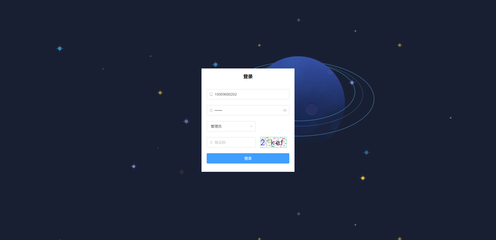
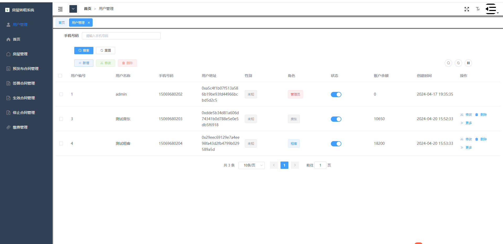
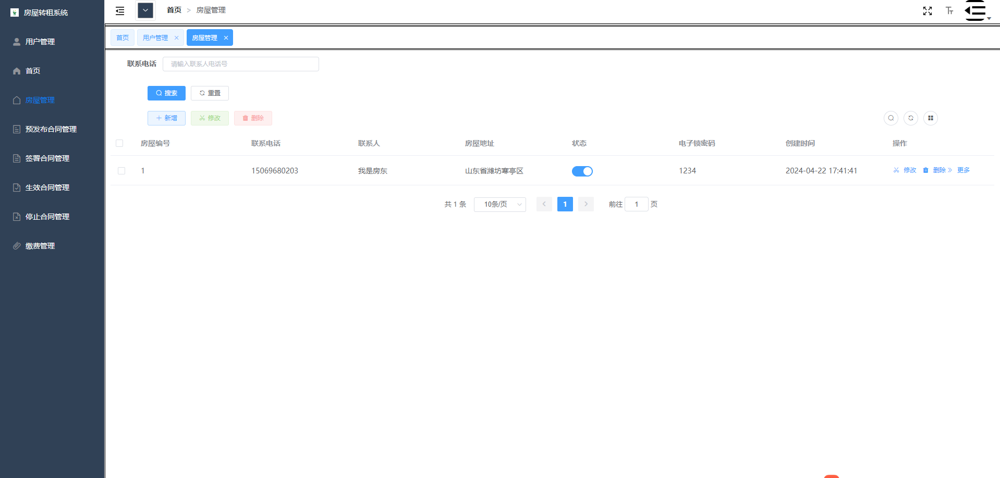
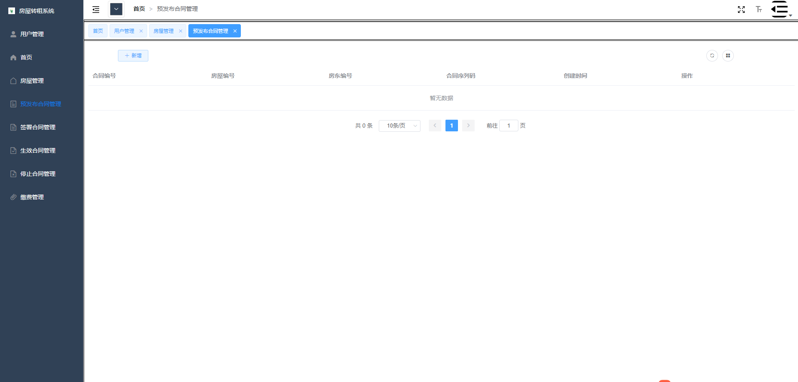
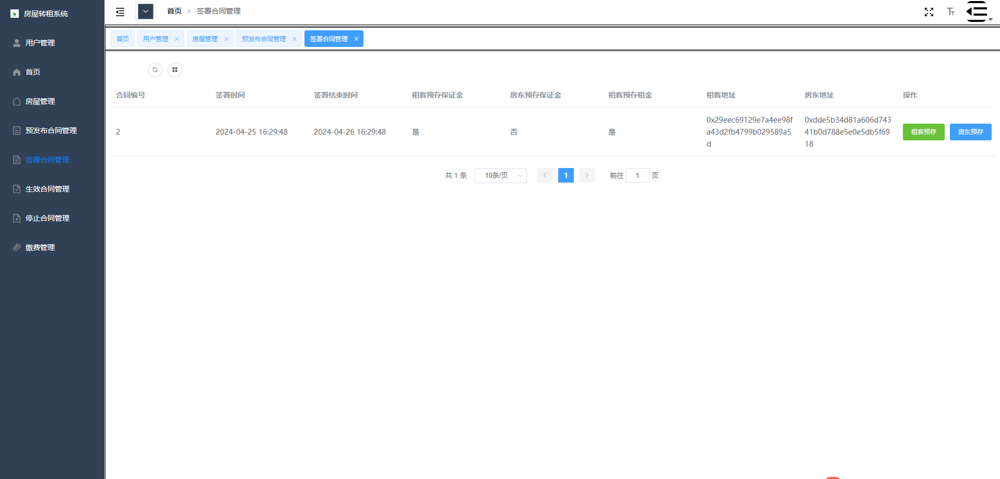
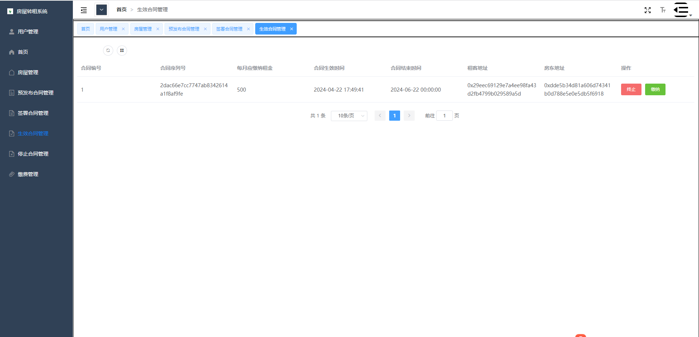
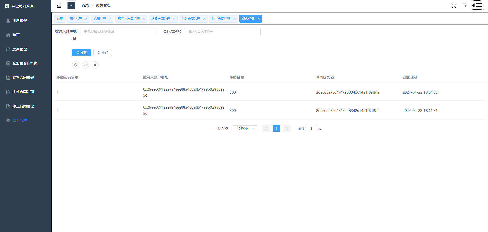
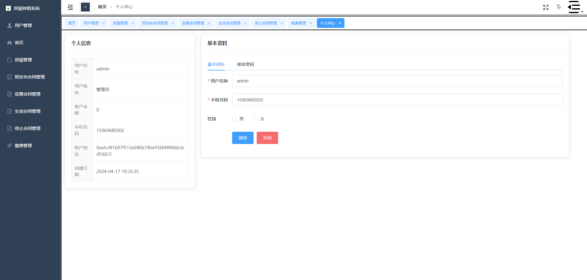

# 房屋转租系统

## 项目概述

一个基于区块链技术的web房屋转租系统。本系统角色分为3个：管理员、租客、房东。基于https://github.com/junzhumiao/goods-manage

该系统开发。该系统主要实现了出租房屋、合同发布、签署合同、合同终止、房租缴纳,并结合区块链技术,将实体部分信息上链,实现去中心化存储。从而保证数据防篡改、共识、真实有效。

## 项目所涉及技术栈：

智能合约：Solidity

服务端：SpringBoot、Mybatis-plus、Redis、Fisco-Bcos、Hutool

客户端：Vue、axios、Vue-cli、Vuex、Vue-router、Element-UI


## 项目安装和使用

服务端：

1.搭建4节点区块链网络（fisco-bcos）

2.搭建webase-front

3.将contract-me包下的合约部署在webase-front平台


4.在application.yml更改fisco连接配置、webase-front连接配置，在application-hikari.yml更改MySQL连接配置，运行nice.SQL文件

在application-redis.yml更改Redis连接配置

客户端：

打开front-me项目:

```
# 执行
npm -i
# 再执行
npm run serv
```

## 项目展示

### 登录



### 用户管理



### 房屋管理



### 预发布合同管理



### 签署合同管理



### 生效合同管理



### 缴费管理



### 个人中心

